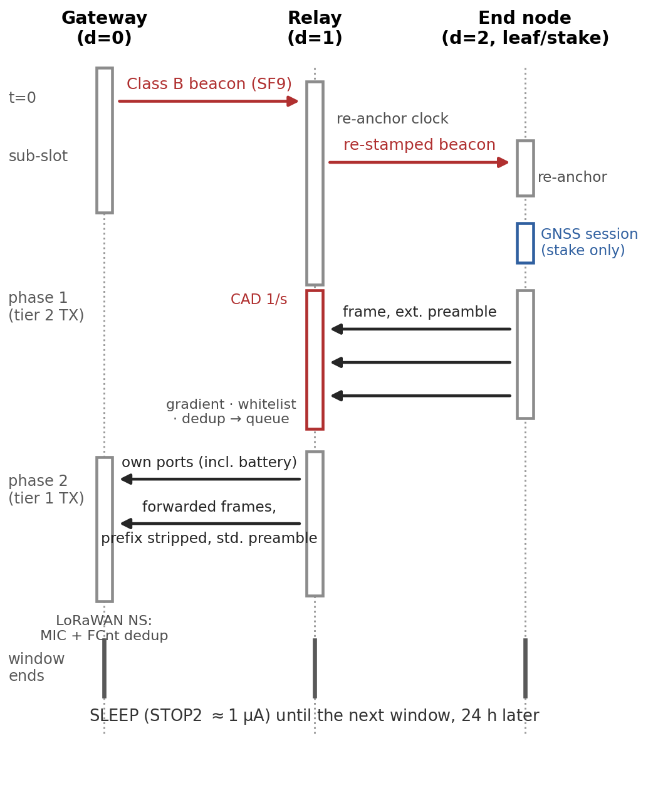
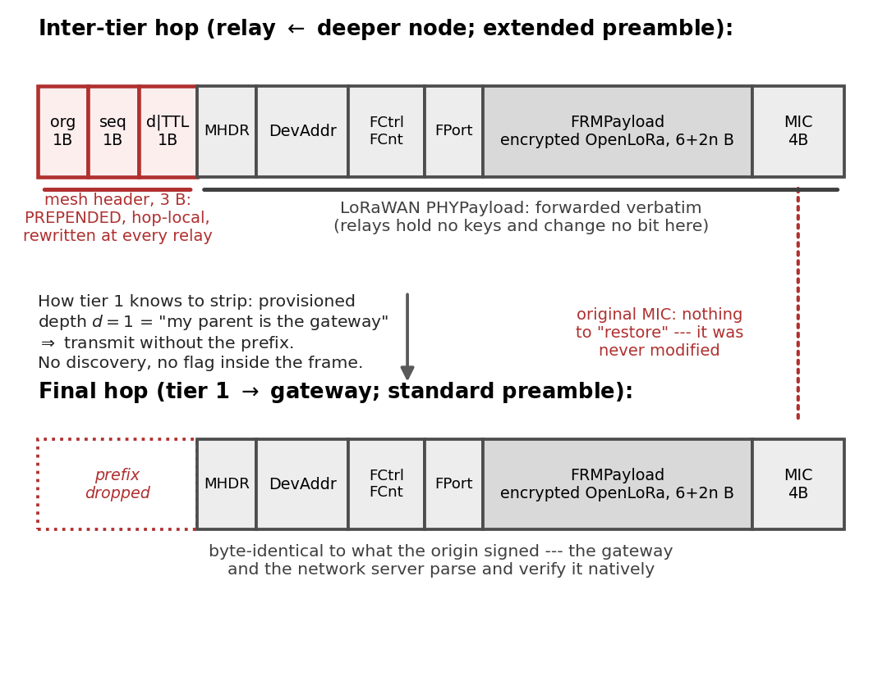
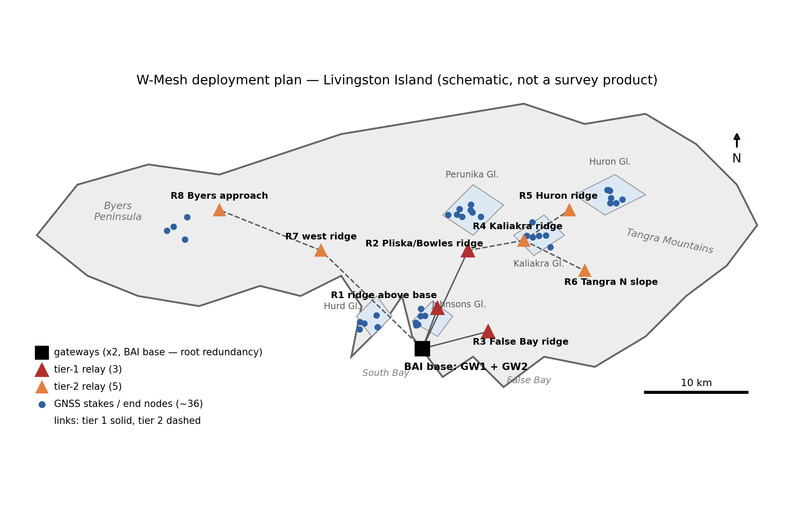
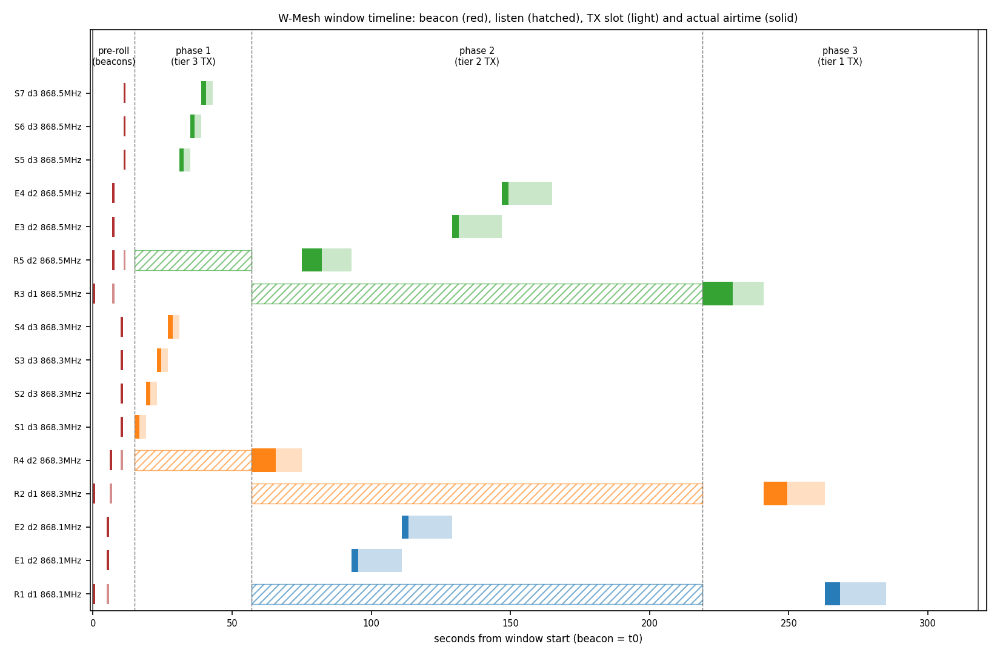

# W-Mesh — reference implementation (Stage 1)

W-Mesh exists to solve one concrete problem: **covering Livingston Island
(Antarctica) with a sensor network without deploying gateway infrastructure
across it**. The Bulgarian Antarctic base runs a duty-cycled LoRaWAN network
— everything sleeps except a ~15-minute daily window — but LoRaWAN is
single-hop, and every additional gateway site (battery, solar, mast) is
infrastructure that must survive the polar winter unattended. Many target
sites (glaciers, ridges, neighbouring bays) can be visited only briefly,
some only by drone.

W-Mesh extends the same windowed, buffered telemetry system with multi-hop
store-and-forward instead: battery relays on ridge lines carry the traffic
of whole valleys and glaciers back to the single existing gateway. Cascade
phases ordered by hop depth, loop freedom by a gradient rule, CAD-gated
listening, and years of battery life on primary cells — coverage grows,
infrastructure does not.

> The underlying windowed deployment this builds on is described in:
> N. Milovanov, B. Tzankov and P. Sapundzhiev, *"Deployment of a low-power
> LoRa LPWAN sensor network for environmental monitoring in Antarctica,"*
> Proc. CompSysTech '26 (Best Paper Award).

Livingston Island is the first deployment, not the limit. The protocol can
be used in **any LoRa/LoRaWAN network whose reach has to grow but where
extra gateways cannot be added, or are not practical to add** — assets one
ridge beyond the last covered valley in water-utility telemetry, remote
farmland, mountain instrumentation, island chains. The mesh layer is
payload-agnostic (relays forward the LoRaWAN frame byte-for-byte and never
read it), so it carries any application format; a device only has to adopt
the windowed discipline: buffer, one slot per day, a fixed channel, the
CAD-length preamble.

## The protocol in short

**The premise.** The whole network — gateway, satellite backhaul, every
node — is asleep except for one scheduled window per day (Livingston:
~15 minutes, anchored at the gateway's Class B beacon around 12:05 UTC).
Nodes buffer a full day of readings and deliver them in that window.
LoRaWAN alone is single-hop; W-Mesh adds store-and-forward on top of it
without touching the LoRaWAN frame.

**The cascade.** The window opens with a short beacon **pre-roll**: the
gateway emits the standard Class B beacon, and relays re-broadcast it
outward tier by tier (in per-relay sub-slots), so every node re-anchors
its clock for the day. Then the uplink **phases** run in order of
DECREASING depth: the deepest tier transmits first while its parents
listen (CAD-gated, ~700× cheaper than continuous RX); each relay then
transmits its own data plus everything it stored, one tier closer to the
gateway per phase. Within a phase every node owns a provisioned time
slot; within the island every tier-1 subtree owns one fixed channel.
Loop freedom needs no timers: a node forwards only frames arriving from
STRICTLY GREATER depth (the gradient rule), so the forwarding graph is a
DAG by construction. One window, one sequence:



**The nodes.** One binary, three provisioned profiles:

| Profile | Measures | Listens | GNSS | Radio budget |
|---|---|---|---|---|
| **leaf** | environment (T/RH) + battery | beacon only | none | ~0.03 mAh/day |
| **relay** | same + forwards its subtree | beacon + CAD phase | optional backup clock (`gnssbk`) | up to ~0.6 mAh/day |
| **stake** | its own GNSS position + battery | beacon only | yes — position IS the payload | ~5 mAh/day (GNSS dominated) |

A stake is technically a leaf (no children); it is a separate profile only
because its payload is the daily averaged GNSS position — the glacier
application. Every profile carries the battery (mV) as its last port.

**The mesh header — where it goes in and where it comes out.** Three
bytes — origin id, sequence, depth|TTL — **prepended to, never written
into, the LoRaWAN frame**:

- **Inserted** by the originating node at transmission; **rewritten** by
  every relay on forward (own depth stamped, TTL decremented). The
  LoRaWAN PHYPayload behind it — ciphertext, frame counter, MIC — is
  forwarded byte-for-byte: relays hold no session keys and need none.
- **Stripped** at tier 1, before the final hop: a tier-1 node knows it is
  the last hop purely from its provisioned depth (d=1 = "my parent is the
  gateway") — no discovery, no flag inside the frame. And there is no MIC
  to restore: it was never modified, so what reaches the gateway is
  byte-identical to what the origin signed, and a standard LoRaWAN
  gateway + network server parse and verify it natively.



Duplicates from multi-parent reception collapse at the next tier via an
(origin, sequence) cache — and at the server via its native multi-gateway
(DevAddr, FCnt) deduplication, to which a W-Mesh relay just looks like
one more gateway reporting a few seconds late.

## Limitations and technical constraints

W-Mesh buys its energy profile with real sacrifices. They are deliberate,
and anyone planning a deployment should read them before the map.

**What the design gives up on purpose:**

- **Latency.** Data moves once per window. W-Mesh is a telemetry
  architecture, structurally incapable of alarming: an event waits up to a
  day, or two after a missed window. If you need alarms, you need a
  different network (or a cellular/satellite side channel).
- **No self-healing.** Topology is static by design — provisioned, not
  discovered. A dead relay silences its whole subtree until someone visits;
  the only insurance is dual parenting (a critical node placed in earshot
  of two relays), which costs one duplicate frame per window.
- **Uplink only.** The cascade carries nothing outward: a deployed network
  cannot be re-provisioned or commanded remotely. The only downlink-ish
  element is the broadcast beacon, which carries time and nothing else.
- **No per-hop acknowledgements.** Delivery probability falls as p^d with
  hop count, and because the cascade is uplink-only, an origin never learns
  that a copy died mid-path. The remedy is redundancy by design: the
  multi-packet backlog extension carries a sliding window of the last K
  days, so a single mid-path loss is repaired a day late, not never.
- **Energy asymmetry.** A fully loaded relay spends ~20x a leaf's radio
  charge. Still shelf-life-limited on a D cell, but relays are the nodes
  whose batteries set the maintenance calendar.
- **Schedule brittleness.** Phases and slots are sized statically at
  enrolment. The whole edifice rests on time discipline: a node that loses
  the beacon free-runs on a widened guard and, past a configured number of
  days, stays silent rather than trample its neighbours' slots (stakes are
  exempt — their daily GNSS session is absolute time; relays can carry a
  gated GNSS backup clock, `--gnssbk 1`).

**Hard numeric constraints (EU868, SF8 reference):**

| Constraint | Value | Where it comes from |
|---|---|---|
| Fan-in per tier-1 relay | 14 descendants | 1% duty cycle: 36 s TX/hour at ~0.6 s/frame |
| Fan-in per deeper relay | 10 descendants | same budget, CAD-length preamble (~0.8 s/frame) |
| Whitelist capacity | 14 ids | 128 B config image |
| Max depth | 15 tiers | 4-bit depth/TTL fields (practically: p^d ends it earlier) |
| Frame size | one frame ≤ MTU | no fragmentation — 222 B at SF7/8, 51 B at SF10+ |
| Frequency | 1 fixed channel per node (end nodes are single-channel devices) | no hopping — a subtree shares its relay's channel; the relay has a single demodulator; only the gateway hears all 8 |
| Backlog recovery at full fan-in | paced over several windows | 3 days x 14 descendants > the 36 s/h duty budget |
| Clock | temperature-compensated RTC required | an uncompensated 32 kHz crystal loses ~9 s/day at -30 C |
| Beacon | gateway must transmit the Class B beacon | nodes are Class A; only the beacon frame is borrowed |

Status: a design with an analytical model and a working protocol core —
not yet a field-validated system. The numbers above assume an
interference-free window and datasheet CAD behaviour; field validation is
the purpose of the first deployment season.

## Layout

```
core/                 portable protocol core — no vendor, no RTOS, no Arduino
  wmesh_core.h        mesh header, gradient rule, dedup cache, forward queue,
                      cascade phase arithmetic
  wmesh_beacon.h      Class B beacon time discipline: parse/re-stamp + CRC16,
                      pre-roll cascade, missed-beacon guard widening
  wmesh_config.h      provisioning block: 128 B flash image (CRC-guarded),
                      defaults, validation — windowUtcSec is the anchor
  wmesh_console.h     boot console parser (pure, host-tested): show/set/save
  gnss.h              STAKE averaging session: NMEA GGA parse (integer-only),
                      quality filter, streaming mean, position port words
  openlora.h          Open LoRa v5 payloads per the published LPMDL-110X
                      document: analog/pulse readings (FPort 11, differential,
                      pulse final counter 32-bit), battery (FPort 13, 3 B)
  wmesh_port.h        the ONLY hardware surface the core needs (radio/RTC/GNSS)
  wmesh_node.h        node state machine: SLEEP -> beacon RX -> listen(CAD)
                      -> TX (own slot) -> SLEEP; LEAF/RELAY/STAKE profiles
                      (diagrams: docs/wmesh-statemachine.png — states per
                      role; docs/wmesh-seq.png — one window as a sequence)
test/
  host_test.cpp       unit tests for the core — run on your laptop, no hardware
  node_sim_test.cpp   whole-node simulation: a scripted radio + clock drives
                      full windows through wmesh_node.h (beacon acquisition
                      and re-anchor, relay re-stamp/forward/dedup/whitelist,
                      freerun-then-silence) — still no hardware
firmware/stm32wl/
  src/main.cpp        entry point; implementing core/wmesh_port.h over the
                      CubeMX-generated CubeWL drivers is the bench task
firmware/xiao-nrf52840/
  bench node: XIAO nRF52840 + Wio-SX1262 kit, RadioLib port of wmesh_port.h,
  bare-leaf profile (no GNSS, no HDC3020 — battery telemetry only);
  `pio run -t upload`, then tools/hiltest.py smoke-tests the boot console
```

## Target hardware

**Primary target: STM32WLE5 (LoRa-E5 / Wio-E5 class).** MCU and SX126x-class
radio share one die (internal SUBGHZ SPI), STOP2 sleep is ~1 uA with the RTC
running, and the same silicon is the production path for integrating W-Mesh
into the LPMDL logger family. 
Generate the board project with STM32CubeMX
(SUBGHZ + RTC + LPUART for GNSS), then implement `core/wmesh_port.h` over the
CubeWL radio driver (`SUBGRF_*`); the portable core needs no changes.

**Bench target: Seeed XIAO nRF52840 + Wio-SX1262 kit**
(`firmware/xiao-nrf52840/`). The same portable core over RadioLib and the
Arduino BSP — used to bring the mesh logic up on real SX1262 radios before
the STM32WL port lands. Its clock is millis-derived and its sleep is a
FreeRTOS delay loop, so its power posture is bench-grade by design; the
deployment-grade STOP2/RTC discipline belongs to the STM32WL target.

## Deployment topology — Livingston Island

The initial application W-Mesh is designed for: extending the Bulgarian
Antarctic base's windowed LoRaWAN network across the island without new
gateways or solar/battery infrastructure.



```
GW1 + GW2 (BAI base, root redundancy — one collision domain)
├── R1  ridge above the base ── env leaves + Johnsons/Hurd stake clusters
├── R2  Pliska/Bowles ridge
│   └── R4  Kaliakra ridge ──── Kaliakra stake cluster
│        ├── R5  Huron ridge ── Huron stake cluster
│        └── R6  Tangra N slope
├── R3  False Bay ridge ─────── False Bay env nodes
└── R7  west ridge
     └── R8  Byers approach ─── Byers env/stake cluster
```

| Tier | Nodes | Role |
|---|---|---|
| 0 | GW1 + GW2 at the BAI base | beacon source + LoRaWAN uplink; two co-located gateways add redundancy, not capacity |
| 1 | R1, R2, R3 (+R7) | ridge relays in direct reach of the base; also ridge weather stations |
| 2 | R4–R8 | second-hop relays towards the outer glaciers |
| 2–3 | ~30 env leaves + ~60 GNSS stakes | HDC3020 telemetry + glacier kinematics |

Planned fleet load: ~102 nodes ≈ 6.7% of the daily 15-minute window (see
the sizing analysis). A schematic plan,
not a survey product — final positions come from the Stage-1 GNSS+RSSI
site survey.

## Run the core tests (no hardware)

```
c++ -std=c++17 -Wall -Wextra -I core test/host_test.cpp -o wmesh_test
./wmesh_test        # -> ALL W-MESH CORE TESTS PASSED
c++ -std=c++17 -Wall -Wextra -I core test/node_sim_test.cpp -o wmesh_sim
./wmesh_sim         # -> ALL W-MESH NODE SIMULATION TESTS PASSED
```

The tests pin the protocol invariants: strict-gradient acceptance (loop
freedom), TTL exhaustion, duplicate suppression, header re-stamping on
forward, the fan-in-bounded queue (56 = 14 descendants x 4 ports), cascade
phase arithmetic, the OpenLoRa differential round-trip at the
197-byte reference buffer, and the beacon path: CRC16 check vector, beacon
parse/corrupt/re-stamp round-trip (GwSpecific verbatim), the outward pre-roll
ordering, and missed-beacon guard widening. The provisioning layer is tested
end to end: config pack/unpack round-trip with CRC corruption, validation of
broken provisioning, and the full console dialogue including rejected input.

The simulation suite goes one level up: the mock port scripts a radio and a
window clock, and entire windows run through the real state machine
(`core/wmesh_node.h`) — blind-boot beacon acquisition and clock re-anchor,
the leaf's battery frame landing in its provisioned slot, relay beacon
re-stamp (+hop delta, GwSpecific verbatim), store-and-forward with dedup /
whitelist / gradient rejects and last-hop prefix stripping, and the
missed-beacon policy (freerun for `maxFreerunDays`, silence after, revival
on the next caught beacon). On hardware, `tools/hiltest.py` smoke-tests a
real node's boot console over USB serial (command round-trips, validation
rejects, flash save, optional persistence-across-reset check).

## Time discipline: the beacon cascade (no GNSS on relays and leaves)

Phase boundaries rest on clock alignment, and LoRaWAN already ships the
primitive: the **Class B beacon** — 17 bytes at SF9 on 869.525 MHz, carrying
GPS-epoch time, deliberately unencrypted and MIC-free, i.e. legal to
re-broadcast *and* to re-stamp. The window opens with a short **pre-roll**
that cascades the beacon *outward* (uplink phases run deepest-first, so the
deepest tier needs time first):

```
t = 0                  gateway emits the beacon
t = 1 x PREROLL_SLOT   tier-1 relays re-broadcast, time field re-stamped
t = 2 x PREROLL_SLOT   tier-2 relays re-broadcast ...
t = H x PREROLL_SLOT   uplink phases begin (deepest tier transmits first)
```

Nodes count their slots **from beacon reception**, so drift only has to hold
across the window itself (100 ppm x 900 s = 90 ms) — an uncompensated cold
crystal is fine *within* the window, and the wake-up listen (±1 s of RX at
4.6 mA ≈ 0.003 mAh/day) is two orders of magnitude cheaper than a daily GNSS
time fix. **GNSS therefore remains only on the STAKE profile**, where position
*is* the payload and time discipline comes free with the averaging session.
A node that misses the beacon free-runs on its last calibration with a guard
widened per silent day (`widenedGuard`), and past `MAX_FREERUN_DAYS` stays
silent rather than transmit into foreign slots.

## Provisioning: the enrolment console

Everything about **when a node wakes** lives in `wmesh::Config` — a CRC-guarded
128-byte flash page edited over the boot console. Connect USB-UART to LPUART1,
reset, press any key within 3 s:

```
W-Mesh enrolment console — 'help' for commands
> show
> set profile relay
> set depth 1
> set phases 300,600          # deepest first; phase count defines H
> set slot 3                  # private slot inside own TX phase
> set whitelist 31,32,33      # designated children (relay only; - = promiscuous)
> set window 12:05            # THE anchor — see below
> set time 1785060000         # UTC epoch -> RTC; do this LAST, before sealing
> save
OK saved
> boot
```

**The window anchor is the BEACON time, not the power-on time.** On Livingston
the infrastructure timer fires at 12:00 UTC (15:00 Bulgarian summer time), the
gateway + Starlink need ~4 min to boot, and Class B beacons ride a 128 s
GPS-aligned grid — so the first beacon lands somewhere around 12:04–12:06 and,
because 86400 % 128 == 0, **repeats at exactly the same second every day**.
Observe it once, then `set window` to that time on every node.

Two mechanisms make this forgiving:

- **Acquisition mode** (`set acq`, default 360 s): on first boot — or after a
  missed day — the node listens long enough to cover the boot jitter plus one
  full 128 s grid period. After the first caught beacon it drops to the tight
  ±guard listen (~0.003 mAh/day).
- **Blind first wake**: a freshly deployed node has never heard a beacon; its
  first wake-up runs purely on the RTC set by `set time` at enrolment plus
  `windowUtcSec`. That is why `set time` comes last, right before sealing.

Validation runs at `save` and refuses inconsistent provisioning (depth > H,
slot overflowing the own phase, whitelist on a non-relay, >14 children, ...).

The old compile-time constants remain only as `configDefaults()` fallback for
a blank or corrupt flash page.

## The network planner

Hand-assigning slots, channels, beacon sub-slots and whitelists across a
fleet is exactly the bookkeeping that produces field bugs — a whitelist
missing one grandchild silently drops that node's data at the relay.
[`tools/plan.py`](tools/plan.py) does all of it from one JSON file:
**you describe the topology and the goals, it produces the configuration
of every node.**

You write only what a human actually knows (see
[`examples/livingston.json`](examples/livingston.json)):

```json
{
  "window": "12:05",
  "preroll_slot": 5,
  "slot_margin": 2.0,
  "phase_margin": 1.5,
  "channels": [868100000, 868300000, 868500000],
  "nodes": [
    {"id": 21, "name": "R1", "profile": "relay", "parent": 0, "gnssbk": 1},
    {"id": 41, "name": "E1", "profile": "leaf",  "parent": 21},
    {"id": 22, "name": "R4", "profile": "relay", "parent": 23},
    {"id": 51, "name": "S1", "profile": "stake", "parent": 22, "ports": 2}
  ]
}
```

The planner derives the rest: **depth** from the parent chain; the
**channel** (one per tier-1 subtree, inherited downward); the **whitelist**
as ALL descendants of a relay (the firmware filters on the origin id, so a
relay must admit its whole subtree); **beacon sub-slots** per tier;
**slot durations** sized to the heaviest node of each tier (own +
forwarded airtime, extended-preamble aware); and the **phase durations**
from the load times the margin — everything rounded upward on purpose, so
a drifted clock or a late frame lands in slack, not on a neighbour.

It then validates what no node can check about itself — fan-in caps
(14 at tier 1, 10 deeper), whitelist capacity, the 36 s/h duty budget,
slot-fits-phase, parent loops — and emits the deliverables:

```
$ python3 tools/plan.py examples/livingston.json       -o examples/livingston-enroll.sh -t examples/livingston-timeline.png
network: 16 nodes, depth H=3, phases (deepest first) = [42, 162, 99], pre-roll 3x5s
window load: 318s of the 900s window (35%)
  tier 1: 3 nodes, slotdur 22s, channels [868100000, 868300000, 868500000]
  tier 2: 6 nodes, slotdur 18s, channels [868100000, 868300000, 868500000]
  tier 3: 7 nodes, slotdur 4s, channels [868300000, 868500000]
plan OK
enroll script written to examples/livingston-enroll.sh
timeline written to examples/livingston-timeline.png
```

The [enroll script](examples/livingston-enroll.sh) is one ready
`tools/enroll.py` line per node (replace PORT, run, reset the node), and
the **window timeline** shows how every node uses its slots — beacons
(red), listening (hatched), allocated slot (light) and actual airtime
(solid), coloured by channel:



**Scripted enrolment** ([`tools/enroll.py`](tools/enroll.py), needs pyserial):
drives the whole dialogue and sends `set time` with the current UTC second
automatically, LAST — so the RTC error at sealing is bounded by serial latency,
not typing speed. One relay, one line:

```
python3 tools/enroll.py /dev/tty.usbserial-XXX \
    --id 21 --profile relay --depth 1 --phases 300,600 \
    --slot 3 --whitelist 31,32,33 --window 12:05 --boot
```

It aborts on the first `ERR` (nothing is saved), prints `show` before saving,
and `--show` alone just inspects a sealed-config node. Reset the node right
after starting the script — it presses the "any key" for you.

## Flash & test

Step-by-step bring-up — unlocking the factory LoRa-E5 (RDP), CubeMX project
generation, flashing over SWD, the two-module bench test, air monitoring,
PPK2 power validation against the energy model, GNSS time-discipline
check and the 24-hour field dry-run — lives in
[`docs/flash-and-test.md`](docs/flash-and-test.md).

## Status

Protocol core: implemented and host-tested. STM32WL port layer: interface
frozen, CubeWL glue pending (Stage 1 bench). 

License: MIT.
